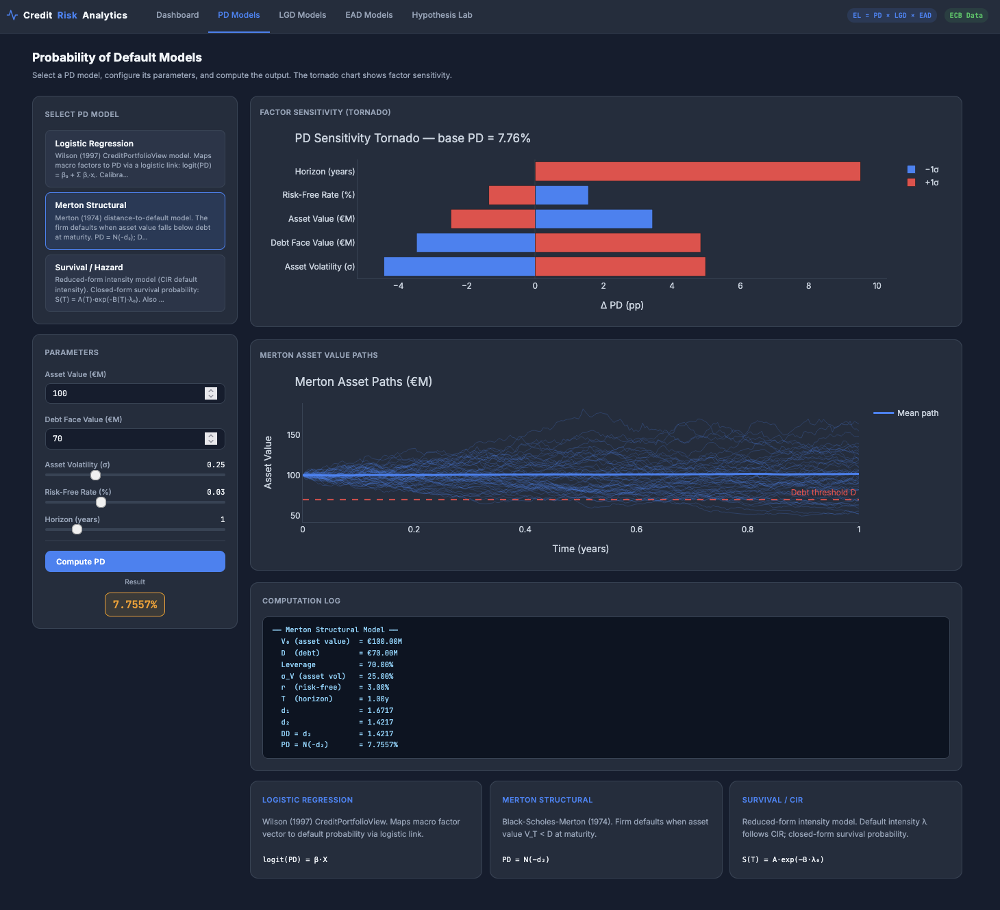

# Credit Risk Analytics

A quantitative credit risk modeling dashboard built with Flask. Computes **Expected Loss = PD × LGD × EAD** using nine interchangeable models, Monte Carlo portfolio simulation, and ECB-style macroeconomic scenario analysis.




## Features

- **9 risk models** across PD, LGD, and EAD — swap them independently per scenario
- **Monte Carlo engine** — Vasicek single-factor correlated defaults, stochastic Beta LGD, 3,000 paths
- **Hypothesis Lab** — compare up to 4 model stacks side-by-side with custom macro assumptions
- **Plotly dark-theme charts** — loss distributions, tornado sensitivity, PD term structure, asset paths
- **CSV export** of scenario comparison results
- **Synthetic ECB macro panel** — 100 quarters (2000–2024) with GFC, COVID, and inflation shocks encoded

## Models

### Probability of Default (PD)
| Model | Key Inputs |
|---|---|
| Logistic Regression | GDP growth, unemployment, policy rate, credit growth, spread |
| Merton Structural | Asset value, debt, asset volatility, risk-free rate, horizon |
| Survival / Hazard | CIR intensity model or Cox PH with macro covariates |

### Loss Given Default (LGD)
| Model | Key Inputs |
|---|---|
| Beta Regression | Seniority, collateral type, LTV, macro stress |
| Workout DCF | Collateral cover, unsecured recovery rate, workout duration, discount rate |
| Downturn / BCBS | Through-the-cycle LGD + composite macro stress addon |

### Exposure at Default (EAD)
| Model | Key Inputs |
|---|---|
| Credit Conversion Factor | Drawn balance, undrawn commitment, CCF rate |
| Utilization Regression | Credit limit, macro-driven logit utilization model |
| Markov Transition | 3-state utilization chain (Low/Med/High), macro-adjusted transition matrix |

## Project Structure

```
credit_risk/
  data/
    ecb_loader.py       # Synthetic ECB macro panel + built-in scenarios
  models/
    base.py             # BaseModel ABC and ModelResult dataclass
    pd/                 # logistic_regression, merton, survival
    lgd/                # beta_regression, workout, downturn
    ead/                # ccf, utilization, markov
  simulation/
    gbm.py              # Geometric Brownian Motion (Merton asset paths)
    vasicek.py          # Vasicek / CIR multi-factor simulation
    monte_carlo.py      # MonteCarloEngine — portfolio loss distribution
  routes/
    dashboard.py        # / — macro overview + portfolio summary
    pd_routes.py        # /pd — PD model tab
    lgd_routes.py       # /lgd — LGD model tab
    ead_routes.py       # /ead — EAD model tab
    comparison.py       # /comparison — Hypothesis Lab
  utils/plots.py        # Plotly figure builders (dark theme)
templates/              # Jinja2: base.html + 5 page templates
static/
  css/style.css         # Dark design system (CSS variables)
  js/app.js             # AJAX, dynamic param forms, scenario management
app.py                  # Entry point: create_app()
```

## Setup

**Requires Python 3.11+**

```bash
python -m venv .venv
source .venv/bin/activate      # Windows: .venv\Scripts\activate
pip install -r requirements.txt
python app.py
```

Open [http://localhost:5000](http://localhost:5000).

## Dependencies

```
Flask==3.0.3
pandas==2.2.2
numpy==1.26.4
scipy==1.13.1
scikit-learn==1.5.0
statsmodels==0.14.2
plotly==5.22.0
```

## Architecture Notes

All models implement the same interface:

```python
class BaseModel(ABC):
    def compute(self, **params) -> ModelResult: ...
    def param_schema(self) -> list[dict]: ...   # drives dynamic UI
```

`param_schema` returns a JSON-serializable list of parameter descriptors (type, min, max, step, default) that the frontend uses to render sliders and inputs automatically — no hand-written HTML per model.

The Monte Carlo engine accepts a `pd_fn(macro_vector) -> float` callable, so the logistic regression model feeds its fitted coefficients directly into portfolio simulation while other models contribute a constant PD.

Built-in macro scenarios (baseline, recession, stagflation, recovery) are defined in `credit_risk/data/ecb_loader.py` as `MacroScenario` dataclasses and surfaced in the Hypothesis Lab toolbar.
